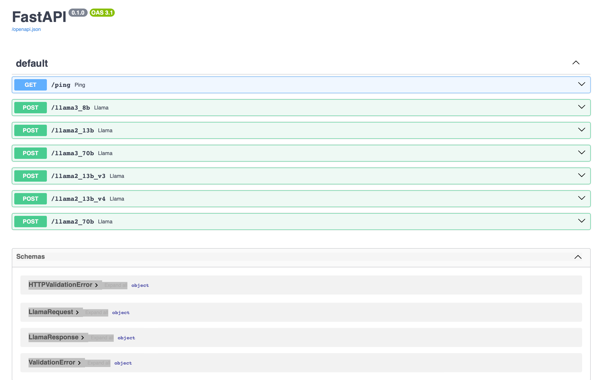

# LLM Backend

## Installation

We use python 3.10. We have tested on macOS and Ubuntu 20.04. You can follow the instructions below to run it.

### Install Requirements

```bash
pip install -r requirements.txt
```

### Modify Config

In `conf/config.json`:

- `CUDA_VISIBLE_DEVICES`: If you have multiple GPUs, you can set the GPU number you want to use here.

- `models`: Key-Value. The key will be used as the api name and the corresponding value is the model directory to be loaded

  The backend supports two models now: LLama2 and LLama3. Key need to be named starting with “llama2” in case of LLaMa2 and "llama3" in case of LLaMa3. For example:

  ```json
  "models":{
    "llama2_xxxx": "/path/to/your/llama2_xxxx.weights",
    "llama3_xxxx": "/path/to/your/llama3_xxxx.weights"
  }
  ```

- `port`: It's the port where the backend will run on your computer.

### Run The Backend

```bash
python main.py
```

## Get Started

You can check the api docs at `server_ip:port/docs`



Here is an example to request the api using python.

```python
import requests
base_url = 'http://your_server_ip:your_port'

data = {
    'user_prompt': 'how to get a diamond?',
    'system_prompt': 'you are an expert in minecraft.',
}
resp = requests.post(base_url + '/your_model_api_name', data=data)
print(resp.json())
'''
{
	'status': 0, 
	'data': 'There are a few ways to obtain diamonds in Minecraft. Here are some of the most common methods:\n\n1. Mining: Diamonds can be found in caves, ravines, and underwater ruins. You can mine for diamonds by using a pickaxe to break apart diamond ore. The ore can be found in blocks that have a diamond shape.\n2. Trading: You can trade with villagers to obtain diamonds. Some villagers, such as blacksmiths, will sell diamonds in exchange for other items.\n3. Enchanting: You can enchant tools and weapons with the "Fortune" enchantment, which will increase your chances of finding diamonds while mining.\n4. Fishing: You can fish for diamonds in rivers, lakes, and oceans. The chance of catching a diamond is low, but it\'s a good way to get diamonds without having to mine for them.\n5. Finding treasure: You can find treasure chests in dungeons, abandoned mineshafts, and other structures. These chests often contain diamonds, as well as other valuable items.\n6. Playing in creative mode: If you\'re playing in creative mode, you can use the "give" command to give yourself diamonds. This is a good way to get diamonds quickly and easily.\n7. Using a mod: There are some mods that can help you obtain diamonds more easily. For example, the "Diamond Mod" adds a new ore that can be mined to obtain diamonds.\n8. Exploring abandoned mineshafts: Abandoned mineshafts often have diamonds in their chests, so exploring these structures can be a good way to find diamonds.\n9. Exploring dungeons: Dungeons often have diamonds in their chests, so exploring these structures can be a good way to find diamonds.\n10. Playing with a command block: If you have access to a command block, you can use the "give" command to give yourself diamonds. This is a good way to get diamonds quickly and easily.\n\nI hope these tips help you get your hands on some diamonds in Minecraft!'
}
'''

```

