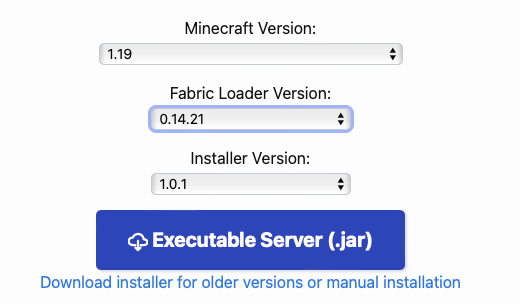

# Run Using Docker

## MineCraft Server Deployment

### Download Server of the Required Version

We use [1.19 version](https://fabricmc.net/use/server/). Put it at `/path/to/your/server-1.9.jar`



### Download Mods

- [Fabric API](https://modrinth.com/mod/fabric-api/version/0.58.0+1.19): Basic Fabric APIs.
- [Mod Menu](https://cdn.modrinth.com/data/mOgUt4GM/versions/4.0.4/modmenu-4.0.4.jar): Used to manage all the mods that you download.
- [Complete Config](https://www.curseforge.com/minecraft/mc-mods/completeconfig/download/3821056): Dependency of server pause.
- [Multi Server Pause](https://www.curseforge.com/minecraft/mc-mods/multiplayer-server-pause-fabric/download/3822586): Used to pause the server when waiting for GPT-4 to reply.

Put them at `/path/to/your/mods`

### Start Server Using Docker Compose File

```yaml
services:
  mc:
    image: itzg/minecraft-server
    tty: true
    stdin_open: true
    ports:
      - "25565:25565"
    environment:
      EULA: "TRUE"
      TYPE: CUSTOM
      ONLINE_MODE: "FALSE"
      CUSTOM_SERVER: "/server/server-1.9.4.jar"
      ALLOW_FLIGHT: "TRUE"
      OPS: |
        bot
        username1
        username2
    volumes:
      # attach the relative directory 'data' to the container's /data path
      - /path/to/your/data:/data
      - /path/to/your/mods:/mods
      - /path/to/your/server:/server
```

## Voyager Deployment

### Clone the code

```bash
git clone url /path/to/your/voyager-llama
```

### Build Docker Image Using Dockerfile

```dockerfile
FROM python:3.9

WORKDIR /app

RUN curl -sL https://deb.nodesource.com/setup_20.x | bash - \
    && apt-get install -y nodejs=20.13.1-1nodesource1

# set your path 
COPY /path/to/your/voyager-llama /app/Voyager

WORKDIR /app/Voyager

RUN pip install -e .

WORKDIR /app/Voyager/voyager/env/mineflayer

RUN npm install -g npx

RUN npm install

WORKDIR /app/Voyager/voyager/env/mineflayer/mineflayer-collectblock

RUN npx tsc

WORKDIR /app/Voyager/voyager/env/mineflayer

RUN npm install

WORKDIR /app/Voyager

CMD ["python", "test.py"]
```

- You need to set your correct path in this line: `COPY /path/to/your/voyager-llama /app/Voyager`

- Then build image using this Dockefile: `docker build -t voyager:v0.1 -f /path/to/your/dockerfile .`  

## Combine MC server and Voyager in a single Docker Compose File

```yaml
services:
  voyager:
    image: voyager:v0.1
    volumes:
      - /path/to/your/voyager-llama:/app/Voyager
      - /path/to/your/sentent-embedding:/sentent-embedding
    tty: true
    stdin_open: true
    environment:
      MC_SERVER_HOST: "mc"
      MC_SERVER_PORT: "25565"
      SENTENT_EMBEDDING_DIR: "/sentent-embedding"

  mc:
    image: itzg/minecraft-server
    tty: true
    stdin_open: true
    ports:
      - "25565:25565"
    environment:
      EULA: "TRUE"
      TYPE: FABRIC
      ONLINE_MODE: "FALSE"
      VERSION: 1.19.4
      REMOVE_OLD_MODS: "TRUE"
      FABRIC_LOADER_VERSION: 0.14.21
      ALLOW_FLIGHT: "TRUE"
      MAX_MEMORY: 8G
      INIT_MEMORY: 8G
      # reduce the load of the server
      VIEW_DISTANCE: 1
      ENTITY_BROADCAST_RANGE_PERCENTAGE: 50
      OPS: |
        bot
        username1
        username2
    volumes:
      # attach the relative directory 'data' to the container's /data path
      - /path/to/your/data:/data
      - /path/to/your/mods:/mods
      - /path/to/your/server:/server
```

- Run: `docker-compose -f /path/to/your/docker-compose.yaml up -d `
- If you want to stop and remove the container: `docker-compose -f /path/to/your/docker-compose.yml down`

## FAQ

1. Can not connect to minecraft server caused by 缺少个人信息公钥

   - You can try to modify `enforce-secure-profile`, set it to `false`.

     

   - Change server version

     Use `1.19.4-fabric-0.14.21`(fabric-api-0.87.1 requires the fabric server version >= 0.14.21)

     

   

2. fabric-0.15.11 server reports errors when loading multiserverpause-fabric-1.1.0

   Downgrade fabric version to 0.14.21.

