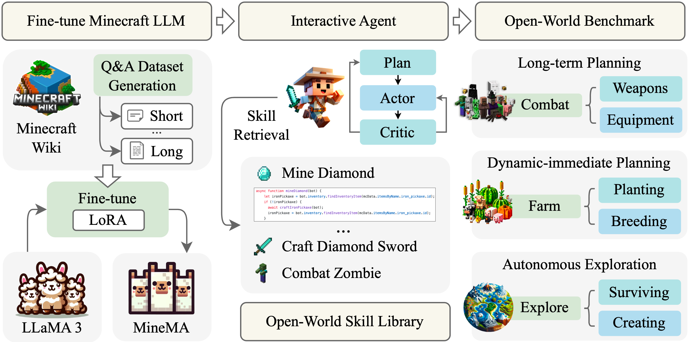

<h1 align="center">Odyssey: Empowering Agents with Open-World Skills</h1>

<div align="center">
	<a href="https://github.com/zju-vipa/Odyssey/blob/master/LICENSE"></a>
	<a href="https://github.com/zju-vipa/Odyssey"></a>
	<a href="https://github.com/zju-vipa/Odyssey"></a>
	<a href="https://github.com/zju-vipa/Odyssey"></a>
	<a href="https://github.com/zju-vipa/Odyssey"></a>
</div>

Official codebase for the paper "[Odyssey: Empowering Agents with Open-World Skills](https://github.com/zju-vipa/Odyssey/blob/master/paper.pdf)". This codebase is based on the [MineDojo](https://github.com/MineDojo/MineDojo) and [Voyager](https://github.com/MineDojo/Voyager) framework.

<div align="center">

</div>

## Overview 

**Abstract:** Recent studies have delved into constructing generalist agents for open-world embodied environments like Minecraft. Despite the encouraging results, existing efforts mainly focus on solving basic programmatic tasks, e.g., material collection and tool-crafting following the Minecraft tech-tree, treating the ObtainDiamond task as the ultimate goal. This limitation stems from the narrowly defined set of actions available to agents, requiring them to learn effective long-horizon strategies from scratch. Consequently, discovering diverse gameplay opportunities in the open world becomes challenging. In this work, we introduce Odyssey, a new framework that empowers Large Language Model (LLM)-based agents with open-world skills to explore the vast Minecraft world. Odyssey comprises three key parts: 

- **(1) An interactive agent with an open-world skill library that consists of 40 primitive skills and 183 compositional skills.**
- **(2) A fine-tuned LLaMA-3 model trained on a large question-answering dataset with 390k+ instruction entries derived from the Minecraft Wiki.**
- **(3) A new open-world benchmark includes thousands of long-term planning tasks, tens of dynamic-immediate planning tasks, and one autonomous exploration task.**
  
Extensive experiments demonstrate that the proposed Odyssey framework can effectively evaluate the planning and exploration capabilities of agents. All datasets, model weights, and code are publicly available to motivate future research on more advanced autonomous agent solutions.


## News
- **`[Jun 13, 2024]`** 🔥 The [GitHub repository]([https://github.com/zijianchen98/GAIA](https://github.com/zju-vipa/Odyssey)) for **ODYSSEY** has been open-sourced!

## Demo

All demonstration videos were captured using the spectator mode within Minecraft. To comply with GitHub's file size restrictions, some videos have been accelerated.

Mining Diamonds from Scratch:

[](https://raw.githubusercontent.com/zju-vipa/Odyssey/master/Odyssey/images/mineDiamond.mp4)

Craft Sword and Combat Zombie:

[](https://raw.githubusercontent.com/zju-vipa/Odyssey/master/Odyssey/images/combatDemo.mp4)

## Contents

- [Directory Description](#Directory-Description)
- [Odyssey Installation](#Odyssey-Installation)
  - [Python Install](#Python-Install)
  - [Node.js Install](#Node.js-Install)
  - [Minecraft Server](#Minecraft-Server)
  - [Embedding Model](#Embedding-Model)
- [Config](#Config)
- [Odyssey Tasks](#Odyssey-Tasks)
  - [Subgoal](#Subgoal)
  - [Long-term Planning Task](#Long-term-Planning-Task)
  - [Dynamic-Immediate Planning Task](#Dynamic-Immediate-Planning-Task)
  - [Autonomous Exploration Task](#Autonomous-Exploration-Task)
- [Related Works](#Related-Works)


## Directory Description

1. **LLM-Backend**

   Code to deploy LLM backend.

2. **MC-Crawler**

   Crawling Minecraft game information from Minecraft Wiki, and store data in markdown format.

3. **MineMA-Model-Fine-Tuning**

     Code to fine-tune the LLaMa model and genearte training and test datasets.

4. **Odyssey**

     Code for Minecaft agents based on a large language model and skill library.

## Odyssey Installation

We use Python ≥ 3.9 and Node.js ≥ 16.13.0. We have tested on Ubuntu 20.04, Windows 10, and macOS.

### Python Install

```bash
cd Odyssey
pip install -e .
pip install -r requirements.txt
```

### Node.js Install

```bash
npm install -g yarn
cd Odyssey/odyssey/env/mineflayer
yarn install
cd Odyssey/odyssey/env/mineflayer/mineflayer-collectblock
npx tsc
cd Odyssey/odyssey/env/mineflayer
yarn install
cd Odyssey/odyssey/env/mineflayer/node_modules/mineflayer-collectblock
npx tsc
```

### Minecraft Server

You can deploy a Minecraft server using docker. See [here](./Odyssey/docs/run_using_docker.md).

### Embedding Model

1. Need to install [git-lfs](https://git-lfs.com) first.

2. Download mebedding model repository

   ```bash
   git lfs install
   git clone https://huggingface.co/sentence-transformers/paraphrase-multilingual-MiniLM-L12-v2.git
   ```

3. The directory where you clone the repository is then used to set `embedding_dir`.

## Config

You need to create `config.json` according to the format of `conf/config.json.keep.this` in `conf` directory.

- `server_host`: LLaMa backend server ip.
- `server_port`: LLaMa backend server port.
- `NODE_SERVER_PORT`: Node service port.
- `SENTENT_EMBEDDING_DIR`: Path to your embedding model.
- `MC_SERVER_HOST`: Minecraft server ip.
- `MC_SERVER_PORT`: Minecraft server port.

## Odyssey Tasks

### Subgoal

```python
def test_subgoal():
    odyssey_l3_8b = Odyssey(
        mc_port=mc_port,
        mc_host=mc_host,
        env_wait_ticks=env_wait_ticks,
        skill_library_dir="./skill_library",
        reload=True, # set to True if the skill_json updated
        embedding_dir=embedding_dir, # your model path
        environment='subgoal',
        resume=False,
        server_port=node_port,
        critic_agent_model_name = ModelType.LLAMA3_8B_V3,
        comment_agent_model_name = ModelType.LLAMA3_8B_V3,
        curriculum_agent_qa_model_name = ModelType.LLAMA3_8B_V3,
        curriculum_agent_model_name = ModelType.LLAMA3_8B_V3,
        action_agent_model_name = ModelType.LLAMA3_8B_V3,
    )
    # 5 classic MC tasks
    test_sub_goals = ["craft crafting table", "craft wooden pickaxe", "craft stone pickaxe", "craft iron pickaxe", "mine diamond"]
    try:
        odyssey_l3_8b.inference_sub_goal(task="subgoal_llama3_8b_v3", sub_goals=test_sub_goals)
    except Exception as e:
        print(e)
```

| Model                          | For what                                                     |
| ------------------------------ | ------------------------------------------------------------ |
| action_agent_model_name        | Choose one of the k retrieved skills to execute              |
| curriculum_agent_model_name    | Propose tasks for farming and explore                        |
| curriculum_agent_qa_model_name | Schedule subtasks for combat, generate QA context, and rank the order to kill monsters |
| critic_agent_model_name        | Action critic                                                |
| comment_agent_model_name       | Give the critic about the last combat result, in order to reschedule subtasks for combat |

### Long-term Planning Task

```python
def test_combat():
    odyssey_l3_70b = Odyssey(
        mc_port=mc_port,
        mc_host=mc_host,
        env_wait_ticks=env_wait_ticks,
        skill_library_dir="./skill_library",
        reload=True, # set to True if the skill_json updated
        embedding_dir=embedding_dir, # your model path
        environment='combat',
        resume=False,
        server_port=node_port,
        critic_agent_model_name = ModelType.LLAMA3_70B_V1,
        comment_agent_model_name = ModelType.LLAMA3_70B_V1,
        curriculum_agent_qa_model_name = ModelType.LLAMA3_70B_V1,
        curriculum_agent_model_name = ModelType.LLAMA3_70B_V1,
        action_agent_model_name = ModelType.LLAMA3_70B_V1,
    )
    
    multi_rounds_tasks = ["1 enderman", "3 zombie"]
    l70_v1_combat_benchmark = [
                        # Single-mob tasks
                         "1 skeleton",  "1 spider", "1 zombified_piglin", "1 zombie",
                        # Multi-mob tasks
                        "1 zombie, 1 skeleton", "1 zombie, 1 spider", "1 zombie, 1 skeleton, 1 spider"
                        ]
    for task in l70_v1_combat_benchmark:
        odyssey_l3_70b.inference(task=task, reset_env=False, feedback_rounds=1)
    for task in multi_rounds_tasks:
        odyssey_l3_70b.inference(task=task, reset_env=False, feedback_rounds=3)
```

### Dynamic-Immediate Planning Task

```python
def test_farming():
    odyssey_l3_8b = Odyssey(
        mc_port=mc_port,
        mc_host=mc_host,
        env_wait_ticks=env_wait_ticks,
        skill_library_dir="./skill_library",
        reload=True, # set to True if the skill_json updated
        embedding_dir=embedding_dir, # your model path
        environment='farming',
        resume=False,
        server_port=node_port,
        critic_agent_model_name = ModelType.LLAMA3_8B_V3,
        comment_agent_model_name = ModelType.LLAMA3_8B_V3,
        curriculum_agent_qa_model_name = ModelType.LLAMA3_8B_V3,
        curriculum_agent_model_name = ModelType.LLAMA3_8B_V3,
        action_agent_model_name = ModelType.LLAMA3_8B_V3,
    )

    farming_benchmark = [
                    # Single-goal tasks
                    "collect 1 wool by shearing 1 sheep",
                    "collect 1 bucket of milk",
                    "cook 1 meat (beef or mutton or pork or chicken)",
                    # Multi-goal tasks
                    "collect and plant 1 seed (wheat or melon or pumpkin)"
                    ]
   	for goal in farming_benchmark:
	      odyssey_l3_8b.learn(goals=goal, reset_env=False)
```

### Autonomous Exploration Task

```python
def explore():
    odyssey_l3_8b = Odyssey(
        mc_port=mc_port,
        mc_host=mc_host,
        env_wait_ticks=env_wait_ticks,
        skill_library_dir="./skill_library",
        reload=True, # set to True if the skill_json updated
        embedding_dir=embedding_dir, # your model path
        environment='explore',
        resume=False,
        server_port=node_port,
        critic_agent_model_name = ModelType.LLAMA3_8B,
        comment_agent_model_name = ModelType.LLAMA3_8B,
        curriculum_agent_qa_model_name = ModelType.LLAMA3_8B,
        curriculum_agent_model_name = ModelType.LLAMA3_8B,
        action_agent_model_name = ModelType.LLAMA3_8B,
        username='bot1_8b'
    )
    odyssey_l3_8b.learn()
```


## Related Works

| **ID** |                          **Paper**                           |                         **Authors**                          |         Venue          |
| :----: | :----------------------------------------------------------: | :----------------------------------------------------------: | :--------------------: |
|   1    | [MineRL: A Large-Scale Dataset of Minecraft Demonstrations](https://arxiv.org/abs/1907.13440) | William H. Guss, Brandon Houghton, Nicholay Topin, Phillip Wang, Cayden Codel, Manuela Veloso, Ruslan Salakhutdinov |       IJCAI 2019       |
|   2    | [Video PreTraining (VPT): Learning to Act by Watching Unlabeled Online Videos](https://arxiv.org/abs/2206.11795) | Bowen Baker, Ilge Akkaya, Peter Zhokhov, Joost Huizinga, Jie Tang, Adrien Ecoffet, Brandon Houghton, Raul Sampedro, Jeff Clune |       arXiv 2022       |
|   3    | [MineDojo: Building Open-Ended Embodied Agents with Internet-Scale Knowledge](https://arxiv.org/abs/2206.08853) | Linxi Fan, Guanzhi Wang, Yunfan Jiang, Ajay Mandlekar, Yuncong Yang, Haoyi Zhu, Andrew Tang, De-An Huang, Yuke Zhu, Anima Anandkumar |      NeurIPS 2022      |
|   4    | [Open-World Multi-Task Control Through Goal-Aware Representation Learning and Adaptive Horizon Prediction](https://arxiv.org/abs/2301.10034) | Shaofei Cai, Zihao Wang, Xiaojian Ma, Anji Liu, Yitao Liang  |       CVPR 2023        |
|   5    | [Describe, Explain, Plan and Select: Interactive Planning with Large Language Models Enables Open-World Multi-Task Agents](https://arxiv.org/abs/2302.01560) | Zihao Wang, Shaofei Cai, Guanzhou Chen, Anji Liu, Xiaojian Ma, Yitao Liang |      NeurIPS 2023      |
|   6    | [Skill Reinforcement Learning and Planning for Open-World Long-Horizon Tasks](https://arxiv.org/abs/2303.16563) | Haoqi Yuan, Chi Zhang, Hongcheng Wang, Feiyang Xie, Penglin Cai, Hao Dong, Zongqing Lu | NeurIPS Workshop  2023 |
|   7    | [Voyager: An Open-Ended Embodied Agent with Large Language Models](https://arxiv.org/abs/2305.16291) | Guanzhi Wang, Yuqi Xie, Yunfan Jiang, Ajay Mandlekar, Chaowei Xiao, Yuke Zhu, Linxi Fan, Anima Anandkumar |       arXiv 2023       |
|   8    | [Ghost in the Minecraft: Generally Capable Agents for Open-World Environments via Large Language Models with Text-based Knowledge and Memory](https://arxiv.org/abs/2305.17144) | Xizhou Zhu, Yuntao Chen, Hao Tian, Chenxin Tao, Weijie Su, Chenyu Yang, Gao Huang, Bin Li, Lewei Lu, Xiaogang Wang, Yu Qiao, Zhaoxiang Zhang, Jifeng Dai |       arXiv 2023       |
|   9    | [STEVE-1: A Generative Model for Text-to-Behavior in Minecraft](https://arxiv.org/abs/2306.00937) | Shalev Lifshitz, Keiran Paster, Harris Chan, Jimmy Ba, Sheila McIlraith |      NeurIPS 2023      |
|   10   | [GROOT: Learning to Follow Instructions by Watching Gameplay Videos](https://arxiv.org/abs/2310.08235) | Shaofei Cai, Bowei Zhang, Zihao Wang, Xiaojian Ma, Anji Liu, Yitao Liang |       arXiv 2023       |
|   11   | [MCU: A Task-centric Framework for Open-ended Agent Evaluation in Minecraft](https://arxiv.org/abs/2310.08367) |       Haowei Lin, Zihao Wang, Jianzhu Ma, Yitao Liang        |       arXiv 2023       |
|   12   | [LLaMA Rider: Spurring Large Language Models to Explore the Open World](https://arxiv.org/abs/2310.08922) | Yicheng Feng, Yuxuan Wang, Jiazheng Liu, Sipeng Zheng, Zongqing Lu |       arXiv 2023       |
|   13   | [JARVIS-1: Open-World Multi-task Agents with Memory-Augmented Multimodal Language Models](https://arxiv.org/abs/2311.05997) | Zihao Wang, Shaofei Cai, Anji Liu, Yonggang Jin, Jinbing Hou, Bowei Zhang, Haowei Lin, Zhaofeng He, Zilong Zheng, Yaodong Yang, Xiaojian Ma, Yitao Liang |       arXiv 2023       |
|   14   | [See and Think: Embodied Agent in Virtual Environment](https://arxiv.org/abs/2311.15209) | Zhonghan Zhao, Wenhao Chai, Xuan Wang, Li Boyi, Shengyu Hao, Shidong Cao, Tian Ye, Jenq-Neng Hwang, Gaoang Wang |       arXiv 2023       |
|   15   | [Creative Agents: Empowering Agents with Imagination for Creative Tasks](https://arxiv.org/abs/2312.02519) |  Chi Zhang, Penglin Cai, Yuhui Fu, Haoqi Yuan, Zongqing Lu   |       arXiv 2023       |
|   16   | [MP5: A Multi-modal Open-ended Embodied System in Minecraft via Active Perception](https://arxiv.org/abs/2312.07472) | Yiran Qin, Enshen Zhou, Qichang Liu, Zhenfei Yin, Lu Sheng, Ruimao Zhang, Yu Qiao, Jing Shao |       arXiv 2024       |
|   17   | [Auto MC-Reward: Automated Dense Reward Design with Large Language Models for Minecraft](https://arxiv.org/abs/2312.09238) | Hao Li, Xue Yang, Zhaokai Wang, Xizhou Zhu, Jie Zhou, Yu Qiao, Xiaogang Wang, Hongsheng Li, Lewei Lu, Jifeng Dai |       arXiv 2024       |


## Contact

This project is developed by [VIPA Lab](https://www.vipazoo.cn/) from Zhejiang University. Please feel free to contact me via email (<liushunyu@zju.edu.cn>) if you are interested in our research :)

<div align="center">

</div>
